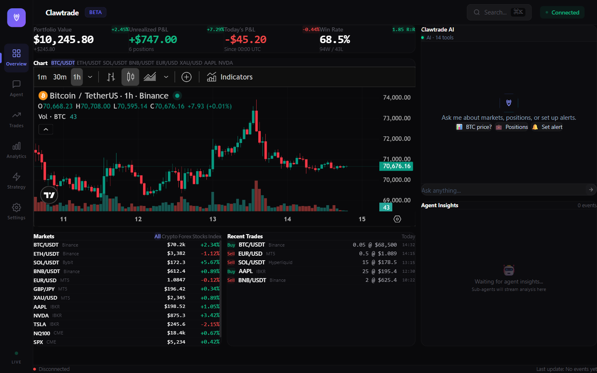
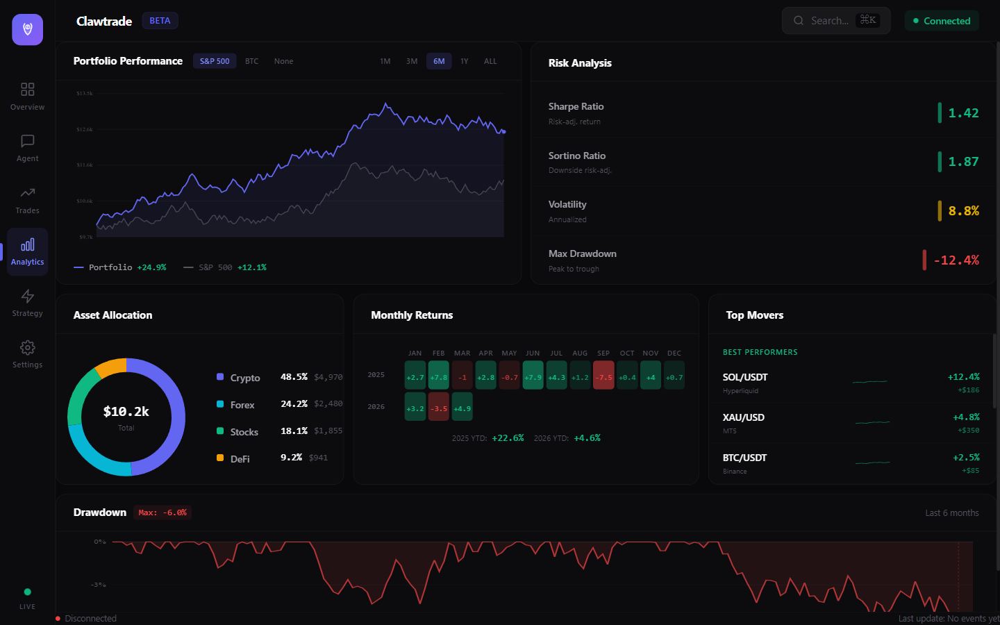
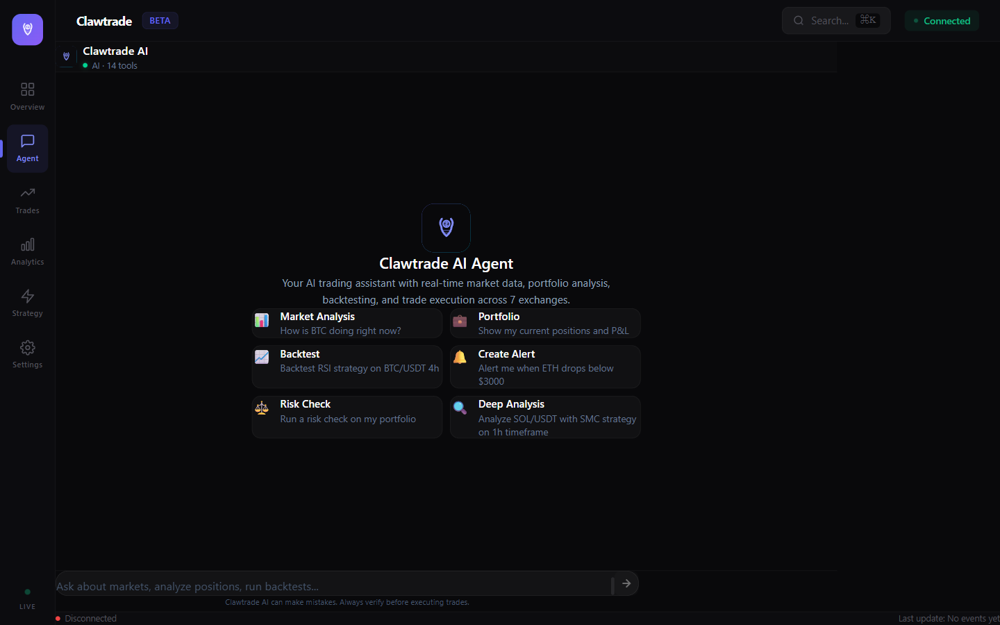

# Clawtrade

**AI Trading Agent Platform — Trade Crypto, Forex, Stocks & DeFi with AI agents.**

Self-hosted, open-source. One platform for Binance, Bybit, OKX, MetaTrader 5, Interactive Brokers, Hyperliquid, and Uniswap.







---

## Quick Start

```bash
# Install
npm install -g clawtrade

# Setup (interactive wizard)
clawtrade init

# Start server
clawtrade serve
```

Open **http://localhost:8899** for the web dashboard.

## Features

### Multi-Asset Trading
- **Crypto CEX** — Binance, Bybit, OKX (spot, futures, margin)
- **Crypto DEX** — Uniswap, Hyperliquid, Jupiter
- **Forex/CFD** — MetaTrader 5 bridge
- **Stocks** — Interactive Brokers gateway
- **Paper Trading** — Simulated mode for risk-free testing

### AI Agent (Tool Use)
- **Real tool use** — Agent calls tools to fetch live data, not just chat
- 9 built-in tools: `get_price`, `get_candles`, `analyze_market`, `get_balances`, `get_positions`, `risk_check`, `calculate_position_size`, `place_order`, `cancel_order`
- Context injection: system prompt includes live balances, positions, risk limits, trade history
- Agent loop: LLM calls tools → executes → returns results → LLM responds with real data
- Supports all 6 LLM providers with native tool use (Anthropic, OpenAI, DeepSeek, OpenRouter, Google Gemini, Ollama)
- **MCP support** — Connect external MCP servers for custom tools (indicators, news, alerts)
- 5 sub-agents: market scanner, risk manager, portfolio optimizer, news analyst, execution engine
- 5-layer memory system with learning from past trades
- Configurable confidence thresholds and confirmation modes

### Risk Management
- Pre-trade risk checks (position size, leverage, exposure limits)
- Real-time P&L monitoring with drawdown alerts
- Circuit breaker for automatic halt on abnormal losses
- Scenario analysis and stress testing

### Web Dashboard
- **Live data** — All widgets connect to real exchange APIs with graceful fallback to demo mode
- Real-time portfolio overview with P&L tracking
- Candlestick charts with EMA overlay (LIVE/DEMO indicator)
- Market overview with live crypto prices from connected exchanges
- Positions table across all exchanges with real-time P&L
- Exchange status showing connected/ready state
- Agent status and chat interface (real LLM integration)
- Full settings panel (exchanges, risk, agent, notifications)

### Notifications
- **Telegram** bot with trade alerts and portfolio commands
- **Discord** webhook notifications
- Configurable alert types: trades, risk, P&L, system events

### Security
- AES-256-GCM encrypted credential vault
- Role-based access control
- Audit logging
- Dead switch emergency shutdown

## Architecture

```
┌─────────────────────────────────────────────────┐
│                  Web Dashboard                   │
│              React + Vite + TypeScript            │
├─────────────────────────────────────────────────┤
│                   API Server                     │
│            REST + WebSocket + GraphQL             │
├──────────┬──────────┬──────────┬────────────────┤
│ AI Agent │   Risk   │ Strategy │   Adapters      │
│ + Memory │  Engine  │  Arena   │ ┌────────────┐ │
│          │          │          │ │ Binance    │ │
│          │          │          │ │ Bybit      │ │
│          │          │          │ │ OKX        │ │
│          │          │          │ │ MT5        │ │
│          │          │          │ │ IBKR       │ │
│          │          │          │ │ Hyperliquid│ │
│          │          │          │ │ Uniswap    │ │
│          │          │          │ └────────────┘ │
├──────────┴──────────┴──────────┴────────────────┤
│  SQLite  │  Vault (AES-256)  │  Event Bus       │
└─────────────────────────────────────────────────┘
```

- **Go** backend for performance and concurrency
- **React** web dashboard
- **TypeScript** CLI and plugin runtime
- **SQLite** for zero-config local storage

## CLI Reference

### Core
```bash
clawtrade init               # Interactive setup wizard
clawtrade serve              # Start server
clawtrade status             # System status
clawtrade version            # Version info
```

### Exchanges
```bash
clawtrade exchange list              # List configured exchanges
clawtrade exchange add binance       # Add exchange (interactive)
clawtrade exchange remove binance    # Remove exchange
clawtrade exchange test binance      # Validate config
```

Supported: `binance`, `bybit`, `okx`, `mt5`, `ibkr`, `hyperliquid`, `uniswap`

### Configuration
```bash
clawtrade config show                # Show all config
clawtrade config set server.port 8080
clawtrade risk show                  # Risk parameters
clawtrade risk set max_leverage 20
clawtrade agent show                 # Agent config
clawtrade agent set auto_trade true
clawtrade agent watchlist add SOL/USDT
```

### AI Models (LLM Provider)
```bash
clawtrade models setup               # Interactive LLM provider setup
clawtrade models set anthropic/claude-sonnet-4-6  # Set model directly
clawtrade models list                # List all providers & models
clawtrade models status              # Show current model config
```

Supported providers: **Anthropic** (Claude), **OpenAI** (GPT), **OpenRouter**, **DeepSeek**, **Google** (Gemini), **Ollama** (local/free)

API keys via environment variables or encrypted vault:
```bash
export ANTHROPIC_API_KEY=sk-ant-...
export OPENAI_API_KEY=sk-proj-...
```

### Notifications
```bash
clawtrade telegram setup             # Setup Telegram bot
clawtrade telegram test              # Send test message
clawtrade notify show                # All notification settings
clawtrade notify set discord.webhook_url <url>
```

### Chat
```bash
clawtrade chat                       # Interactive AI chat
```

## API Endpoints

### LLM Chat
```
POST /api/v1/chat
Body: { "messages": [{ "role": "user", "content": "How is BTC doing?" }] }
```
Proxies to your configured LLM provider (Claude, GPT, Gemini, etc.)

### Market Data
```
GET /api/v1/price?symbol=BTC/USDT&exchange=binance
GET /api/v1/candles?symbol=BTC/USDT&timeframe=1h&limit=100
GET /api/v1/orderbook?symbol=BTC/USDT&depth=20
```

### Account
```
GET /api/v1/balances?exchange=binance
GET /api/v1/positions?exchange=binance
GET /api/v1/exchanges
```

### WebSocket
```
ws://localhost:8899/ws
```
Real-time price streaming from connected exchanges. Subscribe to event types: `market.*`, `trade.*`, `risk.*`

## Configuration

All config stored in `config/default.yaml`:

```yaml
server:
  host: 127.0.0.1
  port: 8899

risk:
  max_risk_per_trade: 0.02    # 2%
  max_daily_loss: 0.05        # 5%
  max_positions: 5
  max_leverage: 10
  default_mode: paper         # paper | live

agent:
  enabled: true
  auto_trade: false
  min_confidence: 0.7
  model:
    primary: "anthropic/claude-sonnet-4-6"
    max_tokens: 4096
    temperature: 0.7
  watchlist:
    - BTC/USDT
    - ETH/USDT

mcp:
  servers:
    - name: news-sentiment
      command: python
      args: [mcp_news_server.py]
      enabled: true

notifications:
  telegram:
    enabled: false
    token: ""
    chat_id: ""
```

MCP servers expose custom tools to the AI agent via the [Model Context Protocol](https://modelcontextprotocol.io). Any MCP-compatible server works — the agent discovers tools automatically at startup.

API credentials are encrypted in `data/vault.enc` (AES-256-GCM).

## Development

### Prerequisites
- Go 1.21+
- Node.js 18+
- Bun (optional, for CLI development)

### Build from source
```bash
git clone https://github.com/Paparusi/Clawtrade.git
cd Clawtrade

# Build Go server
make build

# Start web dashboard (dev mode)
cd web && npm install && npm run dev

# Run server
make run
```

### Project Structure
```
├── cmd/clawtrade/     Go CLI entry point
├── internal/
│   ├── adapter/       Exchange adapters (Binance, Bybit, MT5, etc.)
│   ├── api/           HTTP server, WebSocket, GraphQL
│   ├── bot/           Telegram bot
│   ├── config/        Configuration management
│   ├── database/      SQLite storage
│   ├── engine/        Event bus
│   ├── memory/        AI 5-layer memory system
│   ├── risk/          Risk engine, circuit breaker, monitoring
│   ├── security/      Vault, audit, permissions
│   └── strategy/      Strategy arena and optimizer
├── web/               React dashboard
├── cli/               TypeScript CLI
├── sdk/               Client SDKs (TypeScript, Python, Go)
└── plugins/           Plugin runtime
```

### Run tests
```bash
make test
```

## Tech Stack

| Layer | Technology |
|-------|-----------|
| Backend | Go |
| Frontend | React, TypeScript, Vite |
| Database | SQLite (WAL mode) |
| Encryption | AES-256-GCM, PBKDF2 |
| API | REST, WebSocket, GraphQL |
| CLI | Node.js + Go |

## License

[MIT](LICENSE)
